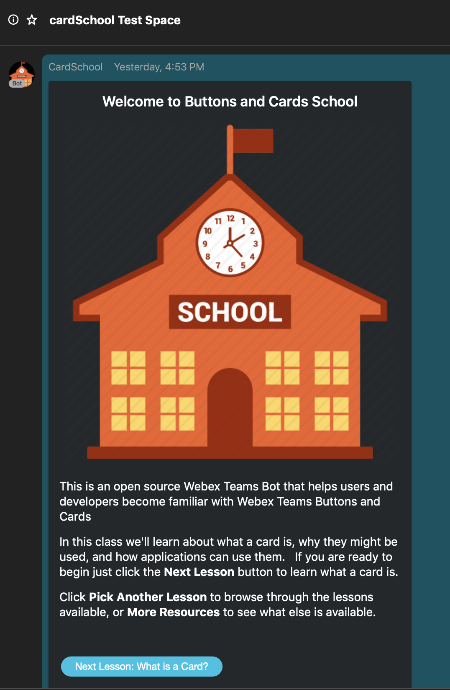

# webex-card-school
Bot to introduce Webex Teams users to [Buttons and Cards Developers Guide](https://developer.webex.com/docs/api/guides/cards).   Through a series of lesons, each presented as a card, users learn what cards are, why applications may choose to use them, and some of the mechanics around designing and posting cards.

As an open source sample, this app itself is part of the training and lessons link back to this source as well as the card source files.

To simply interact with this bot, add cardSchool@webex.bot to a teams space.

## UNDER DEVELOPMENT

This project is still under development and not meant to be broadly used yet.  For more details see the [To Do List](./ToDo.md)

## Checklist to run your own bot (absolute bare minimum to get a local cardSchool bot working)

Prerequisites:

- [ ] node.js (minimum supported v8.15.1 )

- [ ] Sign up for Webex Teams (logged in with your web browser)

----

- [ ] Sign up for nGrok (save API key) and start it on your machine (save the port number and public web address): https://ngrok.com/download

- [ ] Create a Webex Teams Bot (save the email address and API key): https://developer.webex.com/add-bot.html

- [ ] In the directory where you downloaded this project, download the dependencies by typing `npm install` 

## Starting the server

Set the following environmnt varibles in a file if running locally or in your production environment
* WEBHOOK - the url where the application is running WITHOUT the '/jira' on the end.  For example: http://myserver.ngrok.io
* TOKEN - the token that you got when you created your bot at https://developer.webex.com/add-bot.html
* PORT - the port where your app is running.  This is typically needed when running locally with ngrok, and set automatically when running in a production environemnt.
* ADMIN_EMAIL - the email address of the Cisco Spark user to notify about bot activity.  This is generally the developer who maintains this bot
* BOTNAME - the name of the webex bot (used for statistics messages sent to the admin)

Start your node server in your enviornment.  This can be done via a debugger when running locally or by entering the following:
    ```npm start```

## Using the bot

Once the server is up and running Webex Teams users can add the bot to a teams space.

Any message will generate a "selection" card with a drop down list of samples to try.   


## Implementation details

Webex Buttons and Cards functionality is best described in the [Buttons and Cards Developers Guide](https://developer.webex.com/docs/api/guides/cards).  In a nutshell, a bot must [POST requests to the Webex /messages API](https://developer.webex.com/docs/api/v1/messages/create-a-message) with a request body that contains an attachment attribute with information about the card being posted.   If the card contains a button with the Action.Submit type, this will generate an attachmentAction event when a user in the space clicks that button on the card.  In order to be notified of attachmentAction events, an application must register for a [webhook](https://developer.webex.com/docs/api/guides/webhooks) associated with the attachmentAction resource.   Once an attachmentAction webhook is received, the application  can [query the Webex /attachments attchments API](https://developer.webex.com/docs/api/v1/attachment-actions/get-attachment-action-details) to get the decrypted data associated with the card action.

This bot's implementatation leverages the [webex-node-bot-framework](https://github.com/jpjpjp/webex-node-bot-framework) which abstracts away some of this complexity.  It automatically registers the attachmentAction (and all messaging related) webhooks, and gets the decrypted data before emitting an `attacmentAction` event. The framework also creates a `bot` object for each space, that our bot is a part of which allows the developer to call convenience functions such as `bot.say()`, `bot.sendCard()`, and `bot.reply()` which abstract away some of the complexities for calling the Webex RESTful APIs from a node.js based application.

Our [server](./server.js) implements a `framework.on('spawn',..)` handler which will present an introduction each time the bot is added to a new space.   We also have a `framework.hears(/.*/,...)` method which is called anytime a user posts a message to our bot. In response to this message our bot will load our introductory lesson.



Subsequent interaction generally happens via each lesson's buttons. 

The app also supports some traditional bot "text" commands that the user can learn about by typing "help".  (Remember to @mention the bot in a group space!)

## Lesson Content

Developers may wish to modify their own lesson content.  This project strives to create a framework that makes it easy for lesson designers to focus on content creation.

TODO: Add a Creating Lesson Content Readme

**A NOTE ABOUT THE BOT's RESPONSES TO CARD ACTIONS** -- our bot's logic currently sends a threaded reply whenever a user hits a submit button on a card.  At the time of our intial publishing, the API that supports threaded replies is not yet GA.  If you wish to use this feature in your implementation of this bot, please open an issue on this project and we can work to get you early access to this feature.   Alternately, replace the `bot.reply()` function in `handleSubmit` functions with a call to `bot.say()` instead.

## Contributing

TODO: Add a contributing readme

Here is the [To Do List](./ToDo.md)


